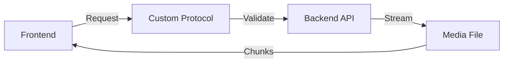

# System Architecture

Version: 1.0.2
Last Updated: February 13, 2025

## Overview

The Media Asset Manager (MAM) is a desktop application built with:
- Electron/React frontend
- Flask/Python backend
- SQLite database
- FFmpeg for media processing
- WebSocket for real-time updates

## System Components

### Frontend (Electron/React)

```
frontend/
├── src/
│   ├── pages/           # Route components
│   │   └── MediaLibrary.js
│   ├── components/      # Reusable UI components
│   │   └── MediaLibrary/
│   │       ├── AssetCard.js
│   │       ├── ListView.js
│   │       └── ViewToggle.js
│   ├── hooks/          # Custom React hooks
│   ├── utils/          # Helper functions
│   └── theme/          # UI theming
├── macos/              # Electron main process
└── tests/              # Frontend tests
```

Key Features:
1. Custom video protocol for secure local file access
2. Real-time updates via WebSocket
3. Responsive grid/list views
4. Thumbnail generation and caching
5. Drag-and-drop interface
6. System health monitoring

### Backend (Flask/Python)

```
backend/
├── app/
│   ├── api/            # REST endpoints
│   ├── models/         # Database models
│   ├── services/       # Business logic
│   └── utils/          # Helper functions
├── tests/              # Backend tests
└── scripts/            # Utility scripts
```

Key Features:
1. RESTful API
2. WebSocket server
3. Media processing queue
4. File system operations
5. Database management
6. Health monitoring

### Database Schema

```sql
-- Core Tables
CREATE TABLE media_assets (
    id INTEGER PRIMARY KEY AUTOINCREMENT,
    title TEXT NOT NULL,
    file_path TEXT NOT NULL UNIQUE,
    file_size INTEGER,
    file_size_mb FLOAT,
    format TEXT,
    duration FLOAT,
    duration_formatted TEXT,
    width INTEGER,
    height INTEGER,
    fps FLOAT,
    codec TEXT,
    container_format TEXT,
    bit_rate INTEGER,
    created_at TIMESTAMP DEFAULT CURRENT_TIMESTAMP,
    updated_at TIMESTAMP DEFAULT CURRENT_TIMESTAMP
);

-- Indexes
CREATE INDEX idx_media_assets_file_path ON media_assets(file_path);
CREATE INDEX idx_media_assets_updated_at ON media_assets(updated_at);
```

## Data Flow

1. Media Discovery


2. Media Streaming


3. Thumbnail Generation


## Security

1. File Access
- Custom video protocol
- Path validation
- API-routed access
- No direct file system access from frontend

2. Data Validation
- Input sanitization
- Path normalization
- Type checking
- Rate limiting

3. Error Handling
- Graceful degradation
- Detailed logging
- User feedback
- Recovery procedures

## Performance

1. Caching
- Thumbnail caching
- Media metadata caching
- Database query caching
- Frontend state caching

2. Optimization
- Lazy loading
- Virtual scrolling
- Chunked streaming
- Batch processing
- Connection pooling

3. Resource Management
- Process cleanup
- Memory monitoring
- Disk space checks
- Connection limits

## Deployment

1. Dependencies
- Python 3.12.1
- Node 18.19.0
- FFmpeg 6.1
- SQLite 3.45.0

2. Configuration
- Environment variables
- Config files
- Logging setup
- Path management

3. Monitoring
- Health checks
- Error tracking
- Performance metrics
- Resource usage

## Development

1. Tools
- VSCode
- SQLite Browser
- FFmpeg
- Chrome DevTools

2. Testing
- Unit tests
- Integration tests
- End-to-end tests
- Performance tests

3. Documentation
- API docs
- Architecture docs
- Development guide
- Troubleshooting guide

## Future Improvements

1. Technical
- Elasticsearch integration
- Cloud sync support
- Multi-user support
- Plugin system

2. Features
- Advanced search
- Batch operations
- Export/Import
- Version control

3. Performance
- Distributed processing
- Better caching
- Optimized indexing
- Parallel processing 