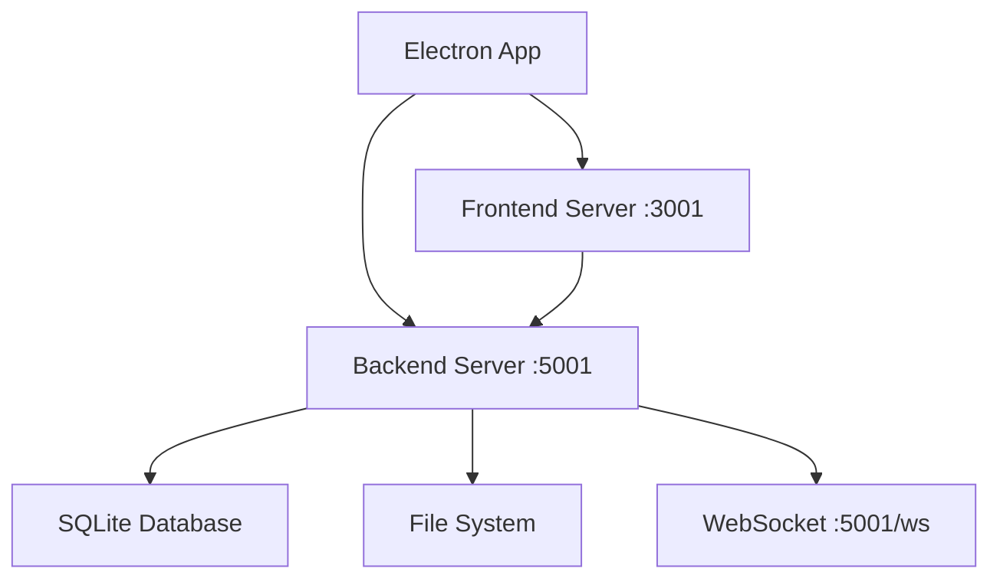

# System Services Documentation

<!-- 
This document serves as the central reference for all system services.
Each service section includes:
- Configuration options
- Default values
- Monitoring endpoints
- Common issues and solutions
- Quick reference commands
-->

## Quick Reference

```bash
# Health Check
curl http://localhost:5001/api/v1/health/status

# Service Management
./scripts/manage_services.sh start    # Start all services
./scripts/manage_services.sh stop     # Stop all services
./scripts/manage_services.sh restart  # Restart all services
./scripts/manage_services.sh cleanup  # Clean temporary files

# Development
./launch_mam.command                 # Start development environment
```

## Environment Setup

### Virtual Environment
The project uses a single virtual environment located at `backend/.venv` with a symbolic link from the project root:
```bash
backend/.venv/     # Main virtual environment location
.venv -> backend/.venv  # Symbolic link for convenience
```

### Environment Files
```bash
backend/.env       # Backend configuration
backend/.env.example  # Example backend configuration
frontend/.env      # Frontend configuration
frontend/.env.development  # Development-specific frontend config
```

## Service Architecture

### 1. Backend Service (Port 5001)
- Flask application
- WebSocket endpoint at `/ws`
- Health monitoring at `/api/v1/health/status`
- SQLite database
- Media processing services

### 2. Frontend Service (Port 3001)
- React development server
- Hot module reloading
- WebSocket client
- Electron integration

### 3. Electron Application
- Native desktop interface
- System tray integration
- File system access
- Media playback

## Service Dependencies



## Health Monitoring

### Endpoints
```http
GET /api/v1/health/status
Response: {
    "status": "healthy",
    "services": {
        "database": true,
        "websocket": true,
        "media_processor": true
    },
    "system": {
        "memory_usage": 65.5,
        "disk_usage": 75.0,
        "cpu_usage": 25.0
    }
}
```

### Monitoring Intervals
- Memory check: Every 60 seconds
- Disk check: Every 300 seconds
- Service health: Every 30 seconds

## Common Issues & Solutions

### 1. Port Conflicts
```bash
# Check ports
lsof -i :5001
lsof -i :3001

# Clean up
./scripts/manage_services.sh stop
```

### 2. Virtual Environment Issues
```bash
# Verify environment
which python  # Should point to backend/.venv/bin/python

# Rebuild if needed
rm -rf backend/.venv
python3.11 -m venv backend/.venv
ln -s backend/.venv .venv
source .venv/bin/activate
pip install -r backend/requirements.txt
```

### 3. WebSocket Connection Issues
```bash
# Check WebSocket status
curl http://localhost:5001/api/v1/health/status

# Restart services
./scripts/manage_services.sh restart
```

## Service Logs

```bash
logs/
├── app.log          # Main application log
├── frontend.log     # Frontend development server
├── websocket.log    # WebSocket connections
└── media.log        # Media processing operations
```

## Cleanup Operations

```bash
# Temporary files
./scripts/manage_services.sh cleanup

# Database
./scripts/manage_services.sh reset-db

# All services
./scripts/manage_services.sh stop
```

<!-- 
Note: This documentation is auto-generated from service configurations
Last updated: 2025-02-03
--> 