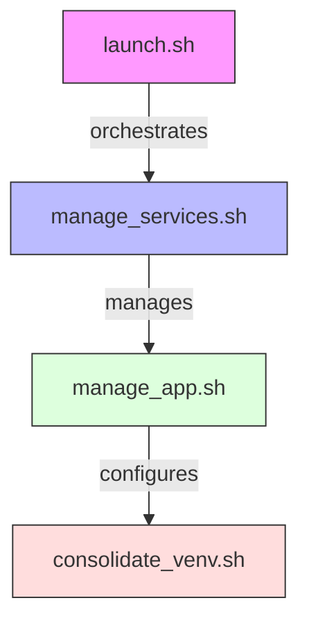

# Shell Scripts Documentation

## Overview

The MAM application uses a set of shell scripts for service management and development tasks. The scripts follow a hierarchical structure for clean separation of concerns:



## Quick Reference

```bash
# Start all services
./launch.sh start

# Stop all services
./launch.sh stop

# Check service status
./launch.sh status

# Scan media directory
./manage_app.sh scan

# Check system health
./manage_app.sh health
```

## Script Details

### launch.sh (v1.0.3)
Entry point for service management
- Validates Python 3.11
- Sets up logging
- Routes commands to service manager
```bash
Usage: ./launch.sh {start|stop|restart|status}
```

### manage_services.sh (v1.0.2)
Service orchestration and monitoring
- Manages virtual environment
- Handles service lifecycle
- Performs health checks
```bash
Environment:
BACKEND_PORT=5001  # Backend service port
FRONTEND_PORT=3001 # Frontend service port
```

### manage_app.sh (v1.0.2)
Development and maintenance tasks
- Controls development environment
- Manages processes
- Handles media scanning
```bash
Commands: start, stop, restart, scan, health
```

### consolidate_venv.sh (v1.0.2)
Python environment management
- Consolidates virtual environments
- Installs dependencies
- Creates symbolic links

## Process Management

### Service Startup
1. Python version check
2. Environment setup
3. Dependency validation
4. Backend start (port 5001)
5. Frontend start (port 3001)
6. Health verification

### Service Shutdown
1. SIGTERM to active processes
2. Grace period wait
3. SIGKILL if necessary
4. PID file cleanup

## Directory Structure
```
/
├── logs/           # Log files
├── pids/           # Process IDs
└── scripts/        # Shell scripts
```

## Troubleshooting

### Common Issues
1. **Port Conflicts**
   ```bash
   # Check port usage
   lsof -i :5001
   lsof -i :3001
   ```

2. **Process Cleanup**
   ```bash
   # Force cleanup
   ./launch.sh stop
   ```

3. **Environment Issues**
   ```bash
   # Rebuild environment
   ./scripts/consolidate_venv.sh
   ```

### Log Files
- `launcher.log`: Launch script logs
- `services.log`: Service manager logs
- `app_manager.log`: Application logs

## Best Practices

1. **Service Management**
   - Always use `launch.sh` as entry point
   - Allow graceful shutdowns
   - Check status before operations

2. **Development**
   - Monitor logs during development
   - Use health checks frequently
   - Clean up processes properly

3. **Troubleshooting**
   - Check logs first
   - Verify port availability
   - Ensure Python version matches 