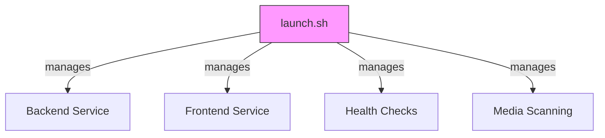

/*
 * File: scripts.md
 * Version: 1.0.4
 * Last Updated: 2025-02-13 11:01 PST
 * Author: Senior Developer
 * Description: Documentation for MAM service management scripts
 * Changes: 
 * - Updated to reflect deprecation of manage_app.sh
 * - Consolidated all operations under launch.sh
 * - Added correct health check and scanning procedures
 */

# Shell Scripts Documentation

## Overview

The MAM application uses shell scripts for service management and development tasks. The primary script is `launch.sh`, which handles all service operations:



## Quick Reference

```bash
# Start all services
./launch.sh start

# Stop all services
./launch.sh stop

# Check service status
./launch.sh status

# Check system health
curl http://localhost:5001/api/v1/health/status

# Scan media directory
./launch.sh scan
```

## Script Details

### launch.sh (v1.0.4)
Primary script for all service operations
- Validates Python 3.12+
- Sets up logging with rotation
- Manages all services
- Performs health checks
- Handles media scanning
```bash
Usage: ./launch.sh {start|stop|restart|status|scan}
```

## Process Management

### Service Startup
1. Python version check
2. Environment setup
3. Dependency validation
4. Backend start (port 5001)
5. Frontend start (port 3001)
6. Health verification

### Service Shutdown
1. SIGTERM to active processes
2. Grace period wait
3. SIGKILL if necessary
4. PID file cleanup

## Directory Structure
```
/
├── logs/           # Log files
├── pids/           # Process IDs
└── scripts/        # Shell scripts
```

## Troubleshooting

### Common Issues
1. **Port Conflicts**
   ```bash
   # Check port usage
   lsof -i :5001
   lsof -i :3001
   ```

2. **Process Cleanup**
   ```bash
   # Force cleanup
   ./launch.sh stop
   ```

3. **Environment Issues**
   ```bash
   # Rebuild environment
   ./scripts/consolidate_venv.sh
   ```

### Log Files
- `launcher.log`: Launch script logs
- `services.log`: Service manager logs
- `backend.log`: Backend application logs
- `frontend.log`: Frontend application logs

## Best Practices

1. **Service Management**
   - Always use `launch.sh` as entry point
   - Allow graceful shutdowns
   - Check status before operations

2. **Development**
   - Monitor logs during development
   - Use health checks frequently
   - Clean up processes properly

3. **Troubleshooting**
   - Check logs first
   - Verify port availability
   - Ensure Python version matches 